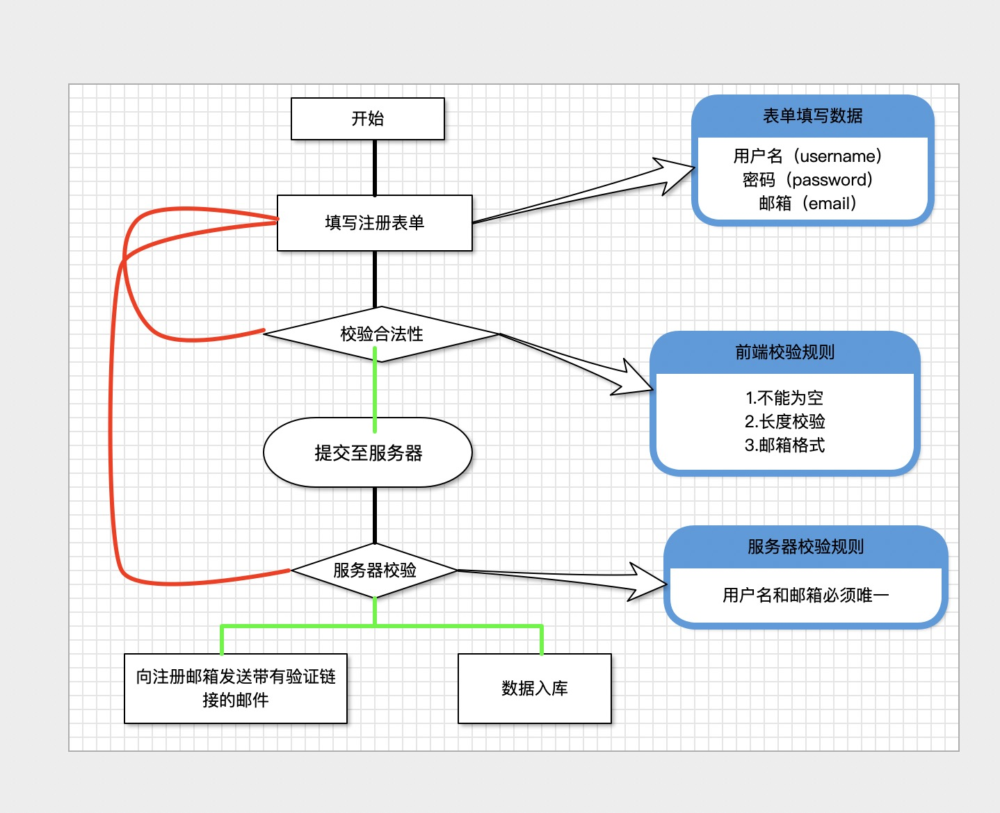
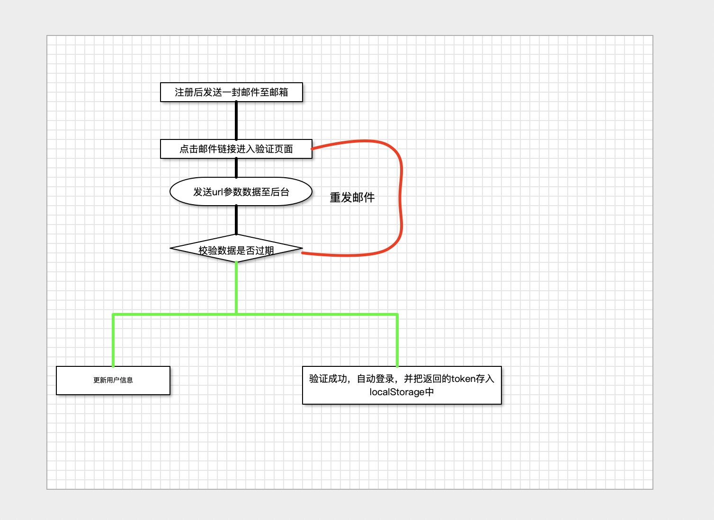
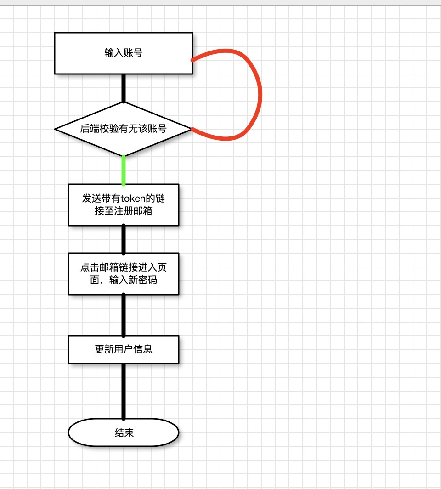

# 任务管理系统

管理自己的任务


## 模块及功能点说明

### 用户模块
 
| 功能点   | 前置条件 | 备注                                                                               |
|----------|----------|------------------------------------------------------------------------------------|
| 登录     | 无       | 1、通过用户名或邮箱登录      2、可以通过session或者jwt保存登录状态                 |
| 注册     | 无       | 密码需要md5加密后入库                                                              |
| 邮箱验证 | 注册     | 注册之后，发送验证码到注册邮箱，进行验证                                           |
| 忘记密码 | 无       | 1、输入账号。      2，发送重置密码url至指定邮箱。      3、在重置密码页面填写新密码 |

### 任务模块

| 功能点         | 前置条件 | 备注                                                                                  |
|----------------|----------|---------------------------------------------------------------------------------------|
| 新增任务       | 需要登录 | 新增任务至当前登录用户                                                                |
| 删除和批量任务 | 需要登录 | 删除当前用户指定的任务                                                                |
| 修改任务       | 需要登录 | 只能修改任务名称，任务备注                                                            |
| 统计情况       | 需要登录 | 1、统计总任务完成情况，饼图展示      2、统计当前任务完成情况，饼图展示                |
| 完成任务       | 需要登录 | 完成任务                                                                              |
| 查询任务       | 需要登录 | 1、默认查询当前登录用户的所有任务      2、通过任务状态、创建时间筛选      3、需要分页 |

### 设置模块
| 功能点           | 前置条件 | 备注                                                             |
|------------------|----------|------------------------------------------------------------------|
| 设置是否需要通知 | 需要登录 | 每天到的指定通知时间后，发送一份邮件到用户邮箱，内容是提示未完成 |
| 设置通知时间     | 需要通知 | 设置通知的时间                                                   |

## 功能流程图(仅供参考)
### 注册

### 验证邮箱

### 忘记密码



## 参考资料
* [nodejs邮件发送就是这么简单](https://blog.csdn.net/bjzhaoxiao/article/details/80903354)
* [echarts文档地址](https://echarts.baidu.com/tutorial.html#5%20%E5%88%86%E9%92%9F%E4%B8%8A%E6%89%8B%20ECharts)


## 成员项目地址
> 在这里填写你的项目仓库地址
```markdown
示例：
[李海](http://github.com/rihel/xxxx)
```
[李海的任务管理系统：仓库地址](https://github.com/Rihel/todo-list)